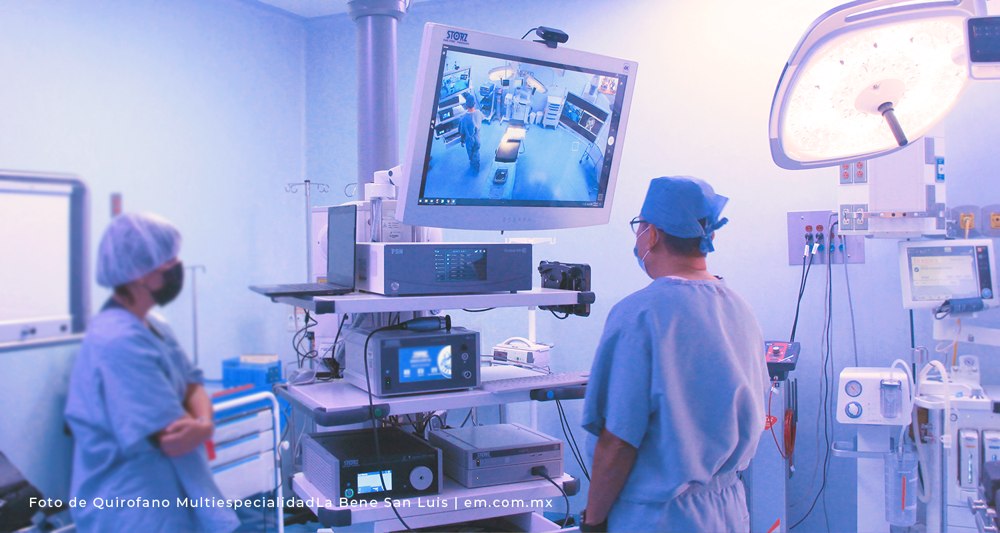

# EEM Projects

EEM has successfully innovated within the specialized niche of operating room integration, with over 200 installations in Mexico’s most prestigious medical institutions. This achievement makes EEM one of the leading companies in operating room installations across the continent. The company is driven by a clear mission to transform surgical spaces in Mexico and Latin America into multidisciplinary rooms equipped with the most advanced technology available, including marLED X surgical lamps, 4K FSN monitors, and Schaerer surgical tables, enabling the performance of any high-specialty procedure.

**EEM Showroom**

**Star Medica**

**Live Streaming Surgery Preparation, Beneficiencia Española**

**First High-Specialty Perinatal Surgery Clinic in Mexico, Instituto Nacional de Perinatología**

**Blue-lighted OR, Hospital de la Mujer**

